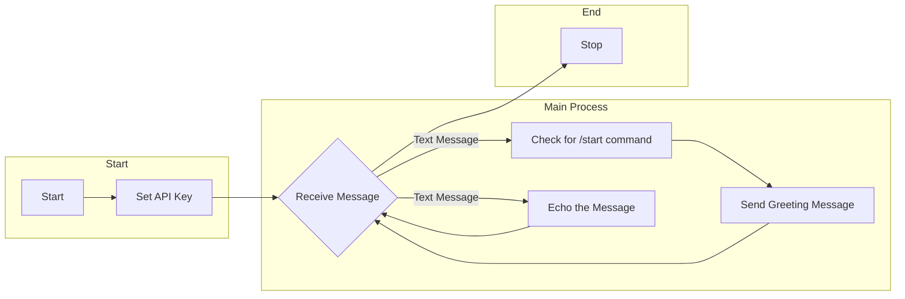

# Echo Bot Readme

## Overview

This is a simple Python Telegram bot that echoes back any text message you send to it. It's a great starting point for beginners who want to create a basic Telegram bot. The bot is created using the `python-telegram-bot` library and responds to both regular messages and the `/start` command.

## Prerequisites

Before you can run this bot, you'll need the following:

1. **Telegram Bot API Token:** You must create a bot on Telegram and obtain an API token from the BotFather. If you haven't done this, follow these steps:

    - Open Telegram and search for the "BotFather" bot.
    - Start a chat with the BotFather and use the `/newbot` command to create a new bot.
    - Follow the instructions, and the BotFather will provide you with an API token. Save this token; you'll need it to run the bot.

2. **Python and `python-telegram-bot` Library:** Make sure you have Python installed on your system. You also need to install the `python-telegram-bot` library. You can do this using pip:

    ```
    pip install python-telegram-bot
    ```

## Getting Started

1. Clone this repository or download the code.


2. Set Your API Token:

    - Open the `main.py` file in a text editor.
    - Replace `'YOUR_API_KEY'` with the API token you obtained from the BotFather.

3. Run the Bot:

    - Open a terminal in the bot's directory and run the Python script:

    ```bash
    python main.py
    ```

    Your bot should now be running.

## How to Use the Bot

- **Start the Bot:** In Telegram, search for your bot's name (the one you gave when creating the bot with the BotFather), and start a chat with it.

- **Sending Messages:** Send any text message to the bot, and it will immediately echo your message back to you.

- **/start Command:** You can also type `/start` to receive a greeting and instructions from the bot.

## Customizing the Bot

- You can customize the bot to do more than just echo messages. The `echo` function in the code is where the bot processes incoming messages. You can modify this function to add your own logic.

- Explore the [python-telegram-bot documentation](https://python-telegram-bot.readthedocs.io/en/stable/) for more advanced features and possibilities.

## Flowchart



## Deployment

To keep your bot running 24/7, consider deploying it to a cloud server, such as AWS, Google Cloud, or Heroku. You can use tools like `webhooks` to receive updates and respond to messages.

## Contributions

Contributions are welcome! If you have any improvements or additional features you'd like to add to this bot, feel free to fork the repository and submit a pull request.

## Support

You can support me by buy me a coffee if u like to.

<div align="left">
<!--   <h4>And you can also support me by <a href="https://www.buymeacoffee.com/azzar" target="_blank">buying me coffee</a></h4> -->
  <a href="https://www.buymeacoffee.com/azzar" target="_blank">
    
  </a>
</div>

---

That's it! You now have a basic Echo Bot up and running. Feel free to experiment with it, customize it, and use it as a foundation for more advanced Telegram bots.