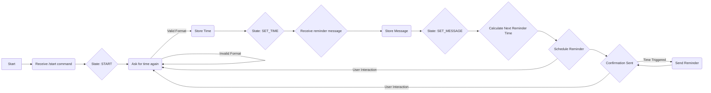

# Reminder Bot Readme

## Introduction

This is a Python Telegram Bot that allows users to set reminders. The bot interacts with users through a conversation, collecting information about the time and message for the reminder. When the time comes, the bot will send a reminder message to the user.

## Getting Started

### Prerequisites

- Python 3.x
- Telegram Bot API Token
- `python-telegram-bot` library (install using `pip install python-telegram-bot`)

### Installation

1. Clone this repository or download the code.

2. Replace `'YOUR_API_TOKEN'` in the code with your actual Telegram Bot API token.

3. Install the required dependencies using the following command:

   ```bash
   pip install python-telegram-bot
   ```

4. Run the bot script:

   ```bash
   python main.py
   ```

## Usage

1. Start a conversation with the bot by sending the `/start` command.

2. The bot will ask you to send the time (in HH:MM format) when you want to be reminded.

3. After providing the time, the bot will ask you to send the reminder message.

4. Once you've provided both the time and message, the bot will confirm that the reminder is set.

5. When the specified time arrives, the bot will send you a reminder message with the content you provided.

## Conversation Flow

The conversation with the bot is divided into three states:

- `START`: The initial state when you start the conversation. It prompts you to send the time.

- `SET_TIME`: After sending the time, it checks if the time is in a valid format and stores it. Then, it asks for the reminder message.

- `SET_MESSAGE`: After you provide the reminder message, it calculates the next occurrence of the reminder (either today or tomorrow if the specified time has already passed today) and schedules the reminder.

## Scheduling Reminders

The bot uses a job queue to schedule reminders. It calculates the delay in seconds until the reminder time and schedules a job to send the reminder at that time.

## Flowchart



## Extending the Bot

You can extend this bot by adding additional features such as:

- Repeating reminders (daily, weekly, etc.).
- Cancelling reminders.
- Managing multiple reminders per user.

To do this, you would need to modify the code and conversation flow accordingly.

## Feedback and Issues

If you encounter any issues with the bot or have feedback for improvements, please feel free to create an issue in the GitHub repository or reach out to the bot developer.

---

Enjoy using the Reminder Bot!
