# README for Telegram Math Solver Bot

This README provides detailed information about setting up and using the Telegram Math Solver Bot, a Python bot that can solve mathematical expressions.

## Table of Contents

- [Introduction](#introduction)
- [Prerequisites](#prerequisites)
- [Installation](#installation)
- [Getting Started](#getting-started)
- [Usage](#usage)
- [Advanced Usage](#advanced-usage)
- [Flowchart](#flowchart)
- [Contributing](#contributing)

## Introduction

The Telegram Math Solver Bot is a Python-based Telegram bot that can help you solve mathematical expressions. It leverages the Telegram Bot API and the SymPy library to evaluate mathematical expressions and provide the results. You can interact with the bot by sending it mathematical expressions, and it will respond with the calculated results.

## Prerequisites

Before you can use the Telegram Math Solver Bot, you need to have the following prerequisites in place:

1. **Telegram Bot API Token**: You should have a Telegram Bot API token. If you don't have one, you can create a new bot and obtain the token by talking to the [BotFather](https://core.telegram.org/bots#botfather) on Telegram.

2. **Python**: You need to have Python installed on your system. The bot is compatible with Python 3.6 and above.

3. **Required Python Libraries**: Install the necessary Python libraries using pip:

   ```bash
   pip install telegram sympy
   ```

## Installation

Follow these steps to install and set up the Telegram Math Solver Bot:

1. Clone or download this repository to your local machine.

2. Change to the project directory

3. Open the `main.py` file in a text editor.

4. Replace `'YOUR_API_TOKEN'` with your actual Telegram Bot API token in the `TOKEN` variable.

## Getting Started

To start using the Telegram Math Solver Bot, follow these steps:

1. Run the bot by executing the following command in the project directory:

   ```bash
   python main.py
   ```

2. Open Telegram and search for your bot's username or the display name you set when creating the bot.

3. Start a chat with your bot by clicking on the "Start" button.

4. Send a mathematical expression to the bot, and it will respond with the calculated result.

## Usage

You can interact with the Telegram Math Solver Bot in the following ways:

- **Start the Bot**: Send the `/start` command to initiate a conversation with the bot.

- **Send Math Expressions**: Send any mathematical expression as a text message to the bot, and it will calculate and reply with the result.

- **Stop the Bot**: If you want to end the conversation with the bot, send the `/stop` command.

## Advanced Usage

The Telegram Math Solver Bot includes some advanced features:

- **Memoization**: The bot caches previously calculated results to improve response time. If you send the same mathematical expression again, it will retrieve the result from the cache.

- **Error Handling**: If the bot encounters an error while trying to solve a math problem, it will provide an error message indicating the issue.

- **Conversation Handler**: The bot uses a conversation handler to manage the flow of interactions. It starts with the `/start` command and can be stopped with the `/stop` command.

## Flowchart

```mermaid
graph LR

subgraph Initialize Bot
    A[Define TOKEN] -->|Replace with API Token| B[Create memo_cache]
    B --> C[Define start function]
    B --> D[Define handle_message function]
    B --> E[Define stop function]
    E --> F[Define main function]
end

A -->|Specify your API Token| Z[Create Telegram Bot]
Z --> X[Create Updater]
X --> Y[Get dispatcher]

subgraph Conversation Handler
    Y --> P[Define conversation handler]
    P --> Q[Define entry points]
    Q --> R[Define START state]
    R --> S[Define MessageHandler for START state]
    S --> T[Define handle_message function]
    Q --> U[Define SOLVING state]
    U --> V[Define ConversationHandler fallbacks]
    V --> W[Define CommandHandler for stop]
    W --> E
    V --> X
end

E -->|Start the bot| G[Start polling]
G --> H[Idle]

H -->|User sends /start| I[Bot replies with greeting]
I --> R

T -->|User sends math expression| J[Bot checks cache]
J -->|Result found| K[Bot replies with cached result]
J -->|Result not found| L[Bot evaluates expression]
L --> M[Bot stores result in cache]
L -->|Bot sends result| N[Bot replies with result]
N -->|User sends /stop| O[Bot ends conversation]
O --> E

```



## Contributing

If you'd like to contribute to the development of the Telegram Math Solver Bot, feel free to fork the repository, make improvements or bug fixes, and submit a pull request. Your contributions are welcome!

## Support

You can support me by buy me a coffee if u like to.

<div align="left">
<!--   <h4>And you can also support me by <a href="https://www.buymeacoffee.com/azzar" target="_blank">buying me coffee</a></h4> -->
  <a href="https://www.buymeacoffee.com/azzar" target="_blank">
    
  </a>
</div>

---

Enjoy using the Telegram Math Solver Bot to quickly calculate mathematical expressions right within your Telegram chat! If you have any questions or encounter issues, feel free to contact the bot developer.
