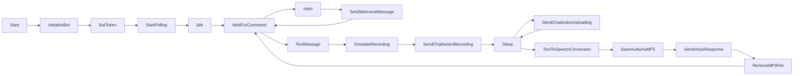

# Telegram Text-to-Speech Bot

## Introduction

This Python script is designed to create a Telegram bot that converts text messages into voice responses. Users can send text messages to the bot, and it will respond with an audio recording of the text in a human-like voice. This README will guide you through setting up and running the bot effectively.

## Key Features

- Utilizes the python-telegram-bot library for Telegram bot functionality.
- Simulates recording actions to enhance user experience.
- Converts incoming text messages into audio with a specified language and accent.
- Sends voice responses back to users in real-time.
- Supports the /start command for initiating conversations.

## Prerequisites

Before you can use this bot, you need to ensure that you have the following prerequisites installed:

- Python 3.x
- [python-telegram-bot](https://python-telegram-bot.readthedocs.io/en/stable/) library
- [gTTS (Google Text-to-Speech)](https://pypi.org/project/gTTS/) library
- A Telegram bot token obtained from [BotFather](https://core.telegram.org/bots#botfather)

## Setup

1. Clone or download this repository to your local machine.

2. Install the required Python libraries:

   ```bash
   pip install python-telegram-bot gTTS
   ```

3. Replace `"your_telegram_bot_token"` in the code with your actual Telegram bot token obtained from BotFather.

## Running the Bot

To run the bot, follow these steps:

1. Open a terminal and navigate to the directory where you saved the bot script.

2. Run the script:

   ```bash
   python main.py
   ```

   Replace `main.py` with the actual name of your Python script if u were renamed it.

3. Once the script is running, your bot should be active on Telegram.

## Bot Commands

### `/start`

- Use this command to start a conversation with the bot.
- Upon receiving this command, the bot will reply with a welcome message: "Hello! Send me a message, and I'll convert it to voice."

## Sending Text Messages

- You can send any text message to the bot in your conversation.

## How the Bot Works

1. When you send a text message to the bot, it simulates the process of recording audio and then uploading it for 2 seconds each to create a more interactive experience.

2. The bot uses the gTTS (Google Text-to-Speech) library to convert the incoming text message into an audio file in English with the 'ca' accent. You can modify the language and accent as needed.

3. The generated voice is saved as an MP3 file named "response.mp3."

4. The bot sends the voice response to the chat where you sent the text message.

5. The "response.mp3" file is removed to clean up after sending the voice response.

## Flowchart



This simplified flowchart represents the key steps and interactions in the code:

  1. Initialization:
  
      - The script starts, and the bot is initialized.
      - The bot token is set.
      - The bot starts polling for incoming messages.
  
  2. Idle State:
  
      - The bot waits for incoming commands or text messages.
  
  3. Command /start:
  
      - If the command /start is received, the bot sends a welcome message and goes back to the idle state.
  
  4. Text Message:
  
      - If a text message is received, the bot simulates recording actions, such as sending a chat action for recording and uploading.
      - After simulating recording, the text is converted to speech using gTTS.
      - The generated audio is saved as an MP3 file.
      - The bot sends the voice response to the user.
      - The MP3 file is removed.
      - The bot goes back to the idle state, waiting for the next command or message.

## Customization

You can customize the bot's behavior by modifying the script according to your preferences. For example, you can change the language and accent used for text-to-speech conversion or adjust the duration of simulated actions.

## Disclaimer

This bot is meant for educational and experimental purposes. Be sure to respect privacy and use it responsibly. Please note that gTTS is an external service, and its availability and performance may vary.

Enjoy using your Telegram Text-to-Speech Bot! If you encounter any issues or have questions, feel free to reach out for assistance.
