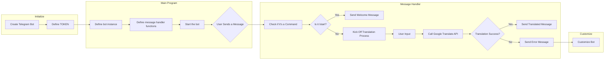

# Telegram Translation Bot

This is a simple Telegram bot that translates user messages using the Google Translate API. Users can send any message, and the bot will respond with the translation to English.

## Features

- Translate user messages into English.
- Handle user interactions seamlessly.
- Designed for easy deployment and modification.

## Prerequisites

Before you begin, ensure you have the following:

- Python 3.x installed.
- A Telegram bot created (get your API token from the [BotFather](https://core.telegram.org/bots#botfather)).
- The required Python packages installed (see 'Installation' section).

## Installation

1. Clone this repository to your local machine or server:

2. Navigate to the project directory:

3. Install the necessary Python packages using `pip`:

   ```bash
   pip install -r requirements.txt
   ```

## Configuration

1. Open the `bot.py` file using a text editor of your choice.

2. Replace `'YOUR_BOT_TOKEN'` with your actual Telegram bot token obtained from the BotFather:

   ```python
   TOKEN = 'YOUR_BOT_TOKEN'
   ```

3. Save the file.

## Usage

To run the Telegram bot, execute the following command in your terminal:

```bash
python main.py
```

## Bot Commands

The bot responds to the following commands:

- `/start`: Starts the bot and provides a welcome message.

## How It Works

1. When you start the bot and send a message, it uses the Google Translate API to translate that message into English.

2. It sends the translated message as a response back to you.

## Customization

This bot provides a basic translation feature. You can customize and extend it according to your requirements. For example, you can:

- Add more language translation options.
- Implement more advanced NLP features.
- Customize the bot's behavior based on user interactions.

## Flowchart



## Contributing

If you'd like to contribute to this project, please follow these steps:

1. Fork the repository on GitHub.

2. Create a new branch with a descriptive name for your feature or bug fix.

3. Make your changes and test them thoroughly.

4. Create a Pull Request with your changes, explaining the purpose and changes in detail.

5. Your Pull Request will be reviewed and merged if it meets the project's standards.

## Support

You can support me by buy me a coffee if u like to.

<div align="left">
<!--   <h4>And you can also support me by <a href="https://www.buymeacoffee.com/azzar" target="_blank">buying me coffee</a></h4> -->
  <a href="https://www.buymeacoffee.com/azzar" target="_blank">
    
  </a>
</div>

---

Thank you for using the Telegram Translation Bot. We hope it proves to be a helpful tool for your Telegram conversations. If you encounter any issues or have suggestions for improvement, don't hesitate to reach out.
