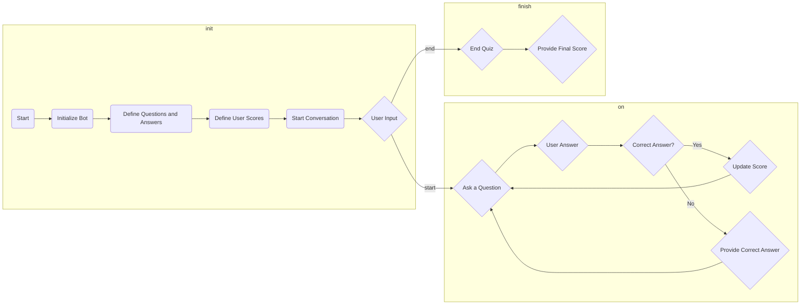

# Trivia Quiz Telegram Bot

This is a simple Python Telegram bot that allows you to create a trivia quiz game. The bot asks users trivia questions, keeps track of their scores, and provides feedback on their answers. It uses the `python-telegram-bot` library to interact with the Telegram API.

## Prerequisites

Before you can run the bot, make sure you have the following prerequisites:

1. Python: You'll need Python 3.x installed on your system.

2. Telegram Bot Token: You should create a Telegram bot and obtain a bot token from the BotFather on Telegram. If you're not familiar with this process, check the official Telegram documentation for creating bots: [Telegram BotFather](https://core.telegram.org/bots#botfather).

3. Python Telegram Bot Library: Install the `python-telegram-bot` library using pip:

   ```bash
   pip install python-telegram-bot
   ```

## Getting Started

1. Clone the repository or download the code.

2. Open the `main.py` file in your favorite code editor.

3. Replace `'YOUR_BOT_TOKEN'` with the actual bot token you obtained from the BotFather. Update this line of code in the `main()` function.

   ```python
   updater = Updater('YOUR_BOT_TOKEN', use_context=True)
   ```

## Running the Bot

To run the bot, follow these steps:

1. Open your terminal or command prompt.

2. Navigate to the directory where you saved the `main.py` file.

3. Run the bot script.

   ```bash
   python main.py
   ```

Your bot should now be up and running.

## Using the Bot

Once your bot is running, you can use it on Telegram. To interact with the bot:

1. Find your bot on Telegram and start a chat with it.

2. Send the `/start` command to initiate the quiz.

3. The bot will ask you a random trivia question.

4. Respond with your answer.

5. The bot will provide feedback on your answer and keep track of your score.

6. You can continue answering questions until you want to end the quiz. Use the `/end` command to finish the quiz.

## Customizing the Questions

To customize the trivia questions and answers, you can modify the `questions` and `answers` lists in the code. Add your own questions and their corresponding answers.

```python
questions = ["What is the capital of France?",
             "What is the largest planet in our solar system?",
             "Who wrote 'Romeo and Juliet'?"]

answers = ["Paris", "Jupiter", "William Shakespeare"]
```

## Bot Commands

The bot supports the following commands:

- `/start`: Start the quiz.
- `/end`: End the quiz and receive your final score.

## Flowchart



## Acknowledgments

- This bot was created with the help of the `python-telegram-bot` library.
- Feel free to customize and expand the bot's functionality to create your own Telegram quiz game.

## Support

You can support me by buy me a coffee if u like to.

<div align="left">
<!--   <h4>And you can also support me by <a href="https://www.buymeacoffee.com/azzar" target="_blank">buying me coffee</a></h4> -->
  <a href="https://www.buymeacoffee.com/azzar" target="_blank">
    
  </a>
</div>

---

Enjoy the quiz, and happy bot building!
